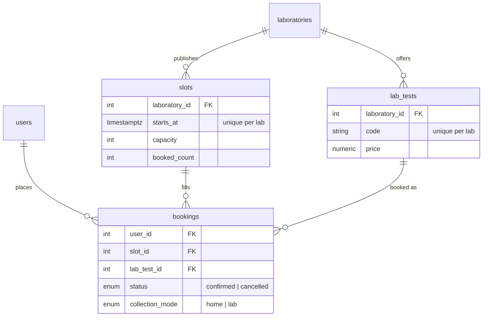

# MediLab API

A lab-test booking backend in **FastAPI + PostgreSQL** — a deliberate re-build of a
healthcare lab-booking microservice I shipped commercially on Node.js + Express +
MongoDB, ported to the Python stack to compare the two ecosystems on the same domain.

**Domain:** diagnostic laboratories publish a test catalog and appointment slots;
customers register, book a test into a slot (home or in-lab sample collection),
and manage their bookings.

## Stack

- **FastAPI** with async path operations, **Pydantic v2** request/response models
- **PostgreSQL 17**, **SQLAlchemy 2.0** (async, typed `Mapped[]` models), **Alembic** migrations
- **JWT auth** (PyJWT, stdlib PBKDF2 password hashing) via a FastAPI dependency
- **pytest** + httpx — the suite runs against a real PostgreSQL database, not mocks
- **Docker Compose** (API + PostgreSQL)

## Design notes (the interesting parts)

### Transactional slot booking

In the original MongoDB service, overbooking was prevented with an atomic
`findOneAndUpdate` filter. Here it's a **row lock inside a transaction**:

```python
slot = await db.scalar(select(Slot).where(Slot.id == body.slot_id).with_for_update())
if slot.booked_count >= slot.capacity:
    raise HTTPException(409, "Slot is fully booked")
slot.booked_count += 1
db.add(Booking(...))
await db.commit()   # counter + booking row commit atomically; lock releases
```

Two concurrent requests for the last seat serialize on `SELECT ... FOR UPDATE`;
the loser re-reads the incremented counter and gets a 409 — never an overbooking.
`tests/test_bookings.py` covers the state machine (fill to capacity → 409,
cancel frees capacity, double-cancel rejected).

### Constraints live in the database

Uniqueness (`(laboratory_id, code)` per catalog, `(laboratory_id, starts_at)` per
slot, user email) is enforced by PostgreSQL constraints, and the API translates
`IntegrityError` into 409s — instead of check-then-insert races guarded in app code.

## Run it

```bash
# Docker
docker compose up --build          # API on :8000, docs at /docs

# Local (Python 3.12+, PostgreSQL running)
pip install -r requirements.txt
cp .env.example .env               # point DATABASE_URL at your Postgres
alembic upgrade head
python -m app                      # see app/__main__.py for the Windows note
```

Interactive OpenAPI docs: http://localhost:8000/docs

## Tests

```bash
# expects a local PostgreSQL with a medilab_test database
python -m pytest -v
```

9 tests: auth flow, catalog CRUD + unique-constraint conflicts + filtering,
and the booking state machine, all against real PostgreSQL.

## Schema


